# Operationalizing-an-AWS-ML-Project
## Dog Image Classification


### Step 1: Training and deployment on Sagemaker

- **Created SageMaker notebook instance** 
I have opted to use a  ml.t3.medium as it was the cheapest option that provides sufficient capacity to run the notebook.

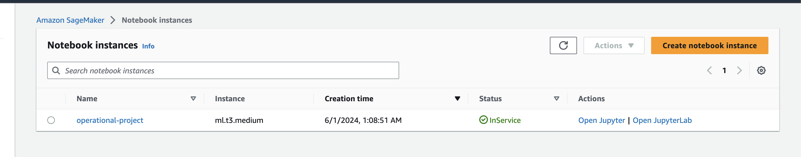

- **S3 bucket** 

I created a bucket called `ud-project-5` to store dataset and model training artifacts 

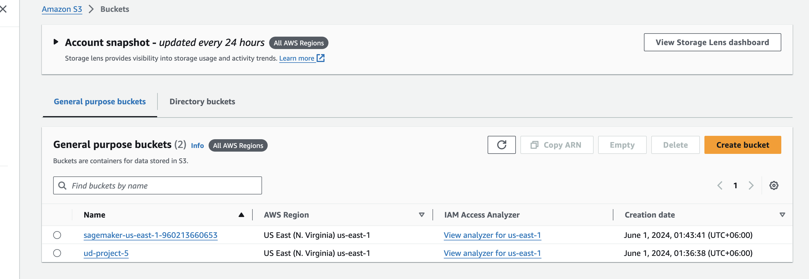

- **Deployment**
At first I trained on single instance `ml.m5.xlarge` instance which took a total of 21 minutes from provisioning to training. 
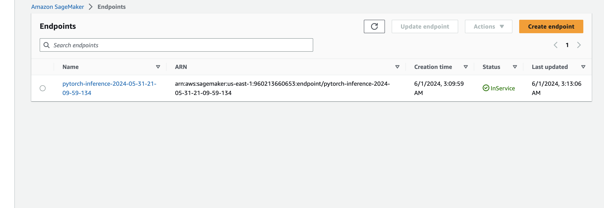
I then trained the same dataset using multi instance mode on 3 `ml.m5.xlarge` instances which also took a total of 21 minutes from provisioning to training models. However I noticed a difference in predicted outcome. For single instance the predicted class was 107 and for multi-instance the predicted class was 19 for the same image.

### Step 2: EC2 Training

I also the model on an EC2 instance. I went for a `t2.micro` instance to keep costs low. The instance had the Deep Learning AMI GPU PyTorch 2.0.0 which comes with the latest version of PyTorch. 

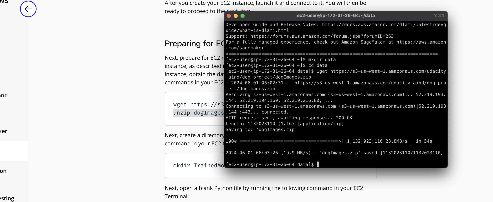
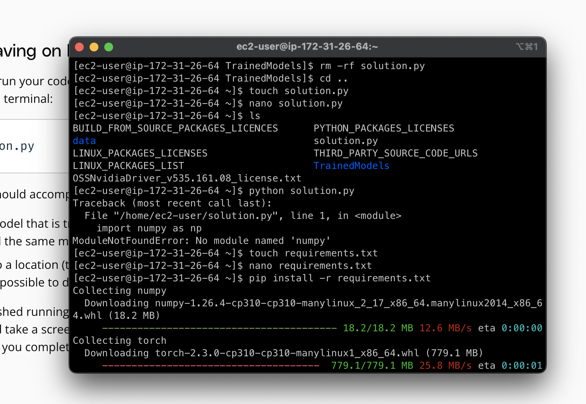
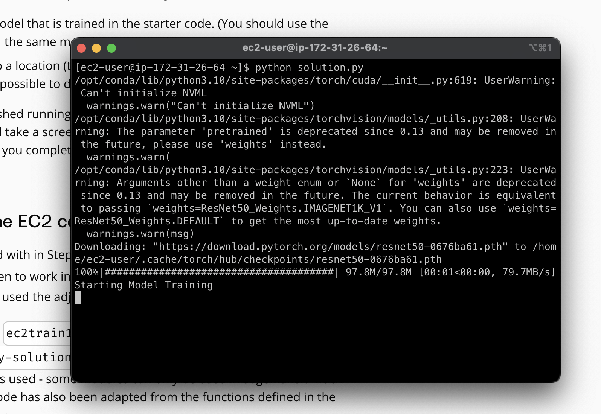
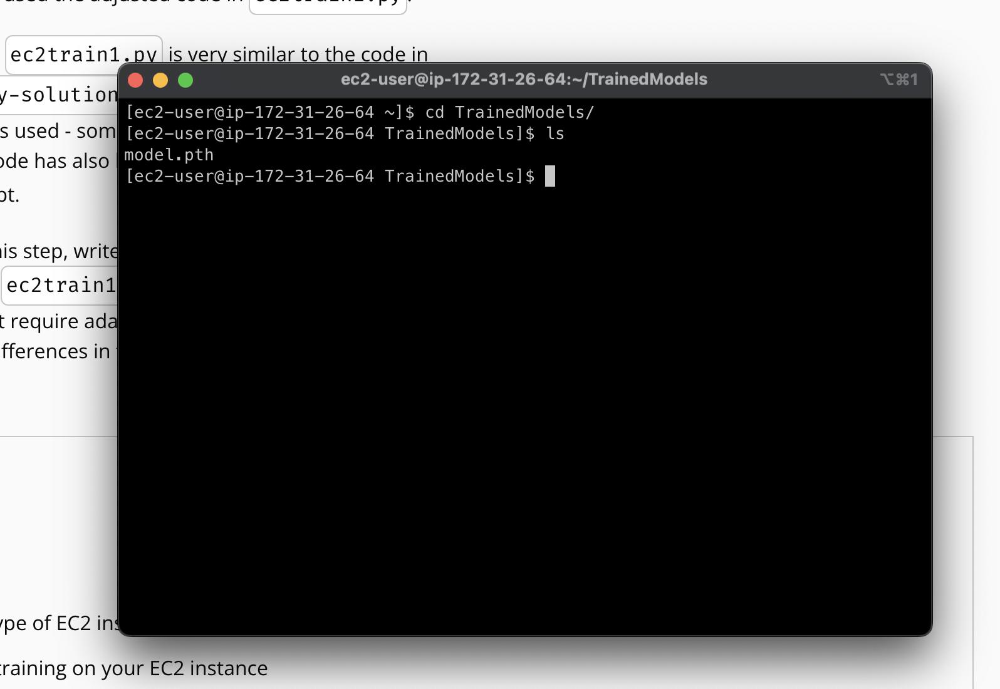

The image above displays the EC2 instance along with the terminal running the **ec2train1.py** script for training the model. The process overall is similar to training the model on SageMaker but is more involved and requires lots of manual steps. I had to adapt the code to include extra loaders and loggers for getting intermediate logs since visiblity during training is not as developed as in sagemaker. It is also not straightforward to perform multi-instance training using ec2 directly like so unlike in SageMaker. The process would require manually setting up and managing clusters. It is also not possible to directly deploy the trained model and get a provisioned endpoint like that of SageMaker. So there is a tradeoff between cost and ease of operation that needs to be considered when comparing these two methods.


### Step 3: Step 3: Lambda Function Setup 
Once the model is trained and deployed, setting up a Lambda function becomes an important next step. Lambda functions play a vital role in enabling access to our model and its inferences by APIs and other programs, making it a crucial step in the production deployment process. The lambda function will act as a proxy between the managed endpoint via SageMaker and any other service. Lambda provides an easier interface to interact with the model without needing to worry about SageMaker specific technicalities and lets other services focus on client specific implementations.

### Step 4: Lambda security setup and testing 

- **Adding SageMaker permission to Lambda Functions**

The lambda function needs proper access and permissions to be able to invoke the endpoint. So there are two related policies needed that needs to be attached to the role that our lambda service assumes

1. Amazon Lambda Full Access - for being able to execute and access functions. Deals with lambda specific operations. 
2. Amazon SageMaker Full Access -  For access SageMaker related services such as deployed endpoints.

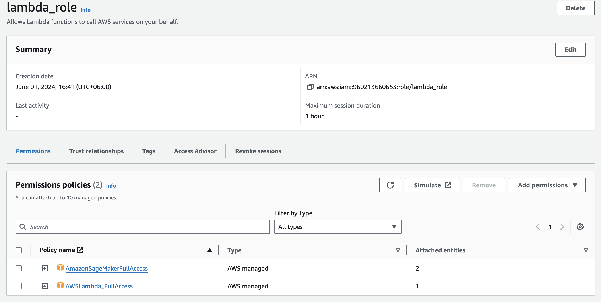

**Vulnerability Assesment** 
- While granting 'Full Access' might resolve the authentication error, it is important to note that this could expose your system to security threats from malicious actors. Therefore, it is best to follow the principle of least privilege, providing only the necessary permissions needed for the task.
- Inactive or outdated roles can compromise the security of Lambda functions. To reduce potential security risks, it is crucial to delete these roles.
- Policies linked to roles that are no longer in use can lead to unauthorized access, posing a security threat. It is advisable to remove these outdated policies to prevent unauthorized access.


- **Testing Lambda Function**
We can test the lambda function with a payload like so 
`{ "url": "https://s3.amazonaws.com/cdn-origin-etr.akc.org/wp-content/uploads/2017/11/20113314/Carolina-Dog-standing-outdoors.jpg" }`
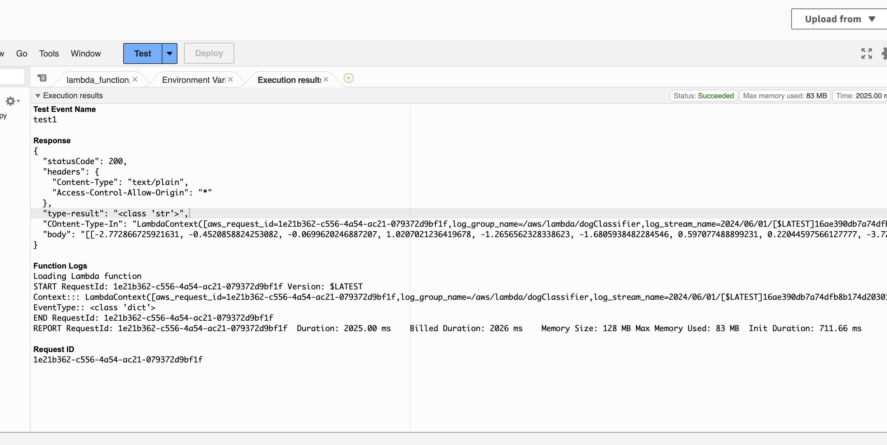


This return the following successfull response
- **Response**
```
{
  "statusCode": 200,
  "headers": {
    "Content-Type": "text/plain",
    "Access-Control-Allow-Origin": "*"
  },
  "type-result": "<class 'str'>",
  "COntent-Type-In": "LambdaContext([aws_request_id=1e21b362-c556-4a54-ac21-079372d9bf1f,log_group_name=/aws/lambda/dogClassifier,log_stream_name=2024/06/01/[$LATEST]16ae390db7a74dfb8b174d2030157c52,function_name=dogClassifier,memory_limit_in_mb=128,function_version=$LATEST,invoked_function_arn=arn:aws:lambda:us-east-1:960213660653:function:dogClassifier,client_context=None,identity=CognitoIdentity([cognito_identity_id=None,cognito_identity_pool_id=None])])",
  "body": "[[-2.772866725921631, -0.4520858824253082, -0.0699620246887207, 1.0207021236419678, -1.2656562328338623, -1.6805938482284546, 0.597077488899231, 0.22044597566127777, -3.727950096130371, 0.0149478018283844, 0.10442353785037994, -0.8082003593444824, -1.5871652364730835, 0.8447507619857788, -2.2288668155670166, -1.5928229093551636, -1.2565498352050781, -0.8174055814743042, -2.514758586883545, 2.9271080493927, 0.2569755017757416, 0.22893425822257996, -1.4374388456344604, -2.527674913406372, -2.0448203086853027, -1.7646063566207886, -0.836272656917572, -1.4819269180297852, -0.48639535903930664, -1.1192713975906372, 0.06256119906902313, -3.0433332920074463, -2.6258673667907715, -0.5589801073074341, -3.182077169418335, -2.0086350440979004, -1.7764962911605835, -0.8530661463737488, 0.32317328453063965, -1.6670114994049072, -0.8119385242462158, -1.504782795906067, 0.5470520257949829, -1.3983391523361206, 0.598111093044281, -2.5566699504852295, -0.2967216968536377, 0.7411710023880005, -1.8417046070098877, -2.4559438228607178, -1.3199149370193481, -4.321587085723877, -2.3618128299713135, -0.698673665523529, -0.8390599489212036, 0.0025038812309503555, -1.2047926187515259, -3.3805670738220215, 0.5631160736083984, -0.7234622240066528, -5.52143669128418, -1.3105794191360474, -3.300391674041748, -2.092977523803711, -0.45638012886047363, -1.4497345685958862, -0.8751531839370728, -1.7195237874984741, -2.3322272300720215, -0.612967312335968, 1.009694218635559, -1.730169653892517, -0.8250561356544495, -3.127805709838867, -2.6805381774902344, 0.5573357343673706, -3.100189208984375, -0.4516258239746094, -1.3502542972564697, -2.0457236766815186, -0.08953046798706055, -3.145982265472412, 1.0500762462615967, 1.3471095561981201, -1.525212049484253, -1.4437544345855713, -1.718518614768982, -2.5736639499664307, -2.2396345138549805, 1.811254620552063, -3.0411322116851807, -1.5068485736846924, -2.943516254425049, -2.3120968341827393, -2.6498425006866455, -0.514922022819519, -1.2997559309005737, 0.5413157939910889, -2.8253231048583984, -3.299901247024536, -1.416429042816162, -1.5069297552108765, -1.9820448160171509, -2.2008378505706787, -1.002126693725586, -1.1012904644012451, -1.7137451171875, -0.09103528410196304, -0.7474773526191711, 0.14276531338691711, -1.684880018234253, -1.2139110565185547, -2.2365643978118896, -1.6026246547698975, -1.7223753929138184, -1.1960601806640625, -3.221437692642212, -0.9101027846336365, -1.4373195171356201, -0.2504878640174866, -1.8917343616485596, -0.7876489162445068, -0.8602615594863892, -1.2563942670822144, -1.821447730064392, -1.4814361333847046, -2.6952857971191406, 0.3045380711555481, -1.7402085065841675, -1.9647136926651, -2.2488210201263428, -0.2636280059814453, -2.761990547180176]]"
}
```
### Step 5: Lambda Concurrency setup and Endpoint Auto-scaling

- **Concurrency**

Enabling concurrency for the Lambda function enhances its capability to manage high traffic by allowing simultaneous responses to multiple requests. I chose to reserve 2 instances and provisioned both of them.

There are two types of concurrency to consider:

- **Provisioned concurrency**: This ensures that computing resources are readily available to handle incoming requests to a Lambda function. It is a cost-effective option; however, there is a fixed limit on the maximum number of instances. If the function receives more requests than the maximum instances, there may be processing delays.

- **Reserved concurrency**: This designates a fixed amount of computing resources specifically for a Lambda function's concurrency. These instances are always active, enabling them to handle all traffic without startup delays, which results in higher costs.

As per my configuration:

```
Reserved instances: 2 out of 1000.
Provisioned instances: 2 out of 2.
```

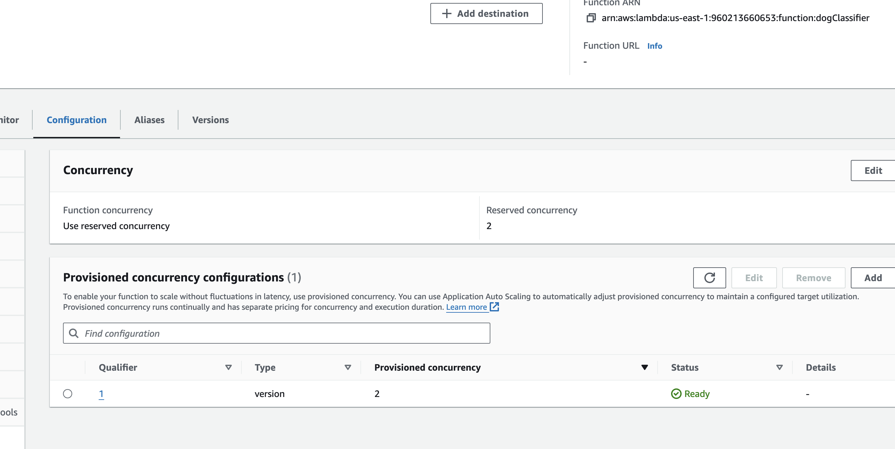


- **Auto-scaling**

Automatic scaling is necessary for SageMaker endpoints to enable response to high traffic. The autoscaling configuration can be set by analysing the demand of our models with metrics such as `RPM`- request per minute, or `TPS`- traffc per second. I configured auto-scaling as follows:

```
Minimum instances: 1
Maximum instances: 3
Target value: 5 (the number of simultaneous requests that will trigger scaling)
Scale-in time: 60 seconds
Scale-out time: 10 seconds.
```

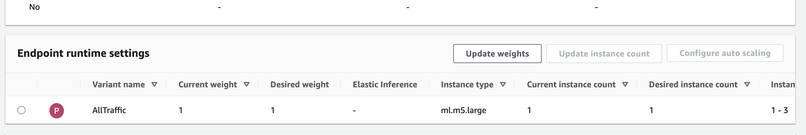
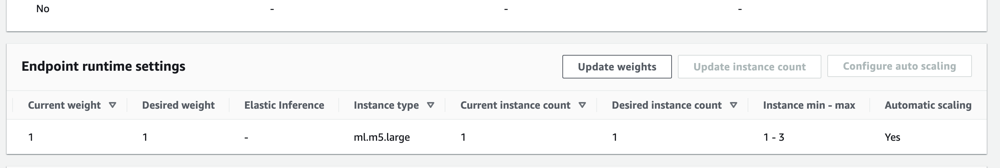

